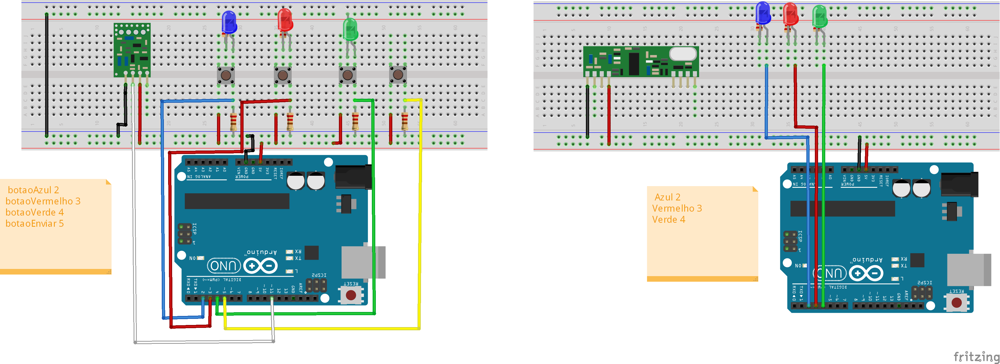

# Documentação do Projeto - Comunicação RF 433 MHz entre Arduinos

## Sumário
1. [Introdução](#introducao)
2. [Diagrama de Pastas](#diagrama-de-pastas)
3. [Componentes Utilizados](#componentes-utilizados)
4. [Funcionamento](#funcionamento)
5. [Detecção de Erros](#deteccao-de-erros)
   - [Passo a Passo do CRC-8](#passo-a-passo-do-crc-8)
   - [Justificativa para o Uso do CRC-8](#justificativa-para-o-uso-do-crc-8)
6. [Critérios de Avaliação](#criterios-de-avaliacao)
7. [Referência](#referencia)

---

## Introdução
A comunicação sem fio entre dispositivos é uma tecnologia amplamente utilizada na eletrônica e na automação. Este projeto tem como objetivo demonstrar a transmissão de dados entre dois microcontroladores Arduino Uno utilizando um módulo de RF 433 MHz (transmissor e receptor). O sistema implementa um protocolo de transmissão de dados na camada de enlace, incluindo detecção de erros via CRC-8.

## Diagrama de Pastas
```
assets/
  images/
    circuito.png
Code/
  Basic/
    Modulo_RF_433_MHz_Receptor.ino
    Modulo_RF_433_MHz_Transmissor.ino
  Detection error/
    Receptor/
      Receptor.ino
    Transmissor/
      Transmissor.ino
Diagram/
  circuito.fzz
```


## Componentes Utilizados
- 2x Arduino Uno
- 1x Módulo RF 433 MHz (transmissor e receptor)
- 3x Push Buttons
- 1x Botão de envio
- 6x LEDs (vermelho, verde e azul)
- Resistores adequados
- Protoboard e jumpers

## Funcionamento
O sistema consiste em dois Arduinos:
- **Transmissor:** Contém três botões para entrada de sequência (verde, vermelho e azul) e um botão de envio. Quando pressionado, transmite a sequência via RF.
- **Receptor:** Recebe os dados e, caso a mensagem esteja íntegra (sem erros), aciona os LEDs na mesma ordem em que os botões foram pressionados no transmissor.

## Detecção de Erros
A transmissão de dados pode ser afetada por interferências, o que pode corromper as mensagens. Para minimizar erros, utilizamos um algoritmo de **CRC-8** para validação dos dados recebidos.

### Passo a Passo do CRC-8
1. **Cálculo no transmissor:** O transmissor calcula o CRC-8 da mensagem antes de enviá-la.
2. **Adiciona o CRC:** O valor do CRC é anexado ao final da mensagem.
3. **Envio da mensagem:** A mensagem + CRC é transmitida.
4. **Recepção:** O receptor recebe os dados e recalcula o CRC da parte da mensagem.
5. **Validação:** Se o CRC calculado for igual ao CRC recebido, a mensagem é aceita e processada. Caso contrário, é descartada.

### Justificativa para o Uso do CRC-8
O **CRC-8** foi escolhido porque:
- É leve e de baixo custo computacional, adequado para o Arduino.
- Detecta erros comuns em transmissões sem fio, como bits corrompidos.
- Implementação simples e eficiente para mensagens curtas.

## Critérios de Avaliação
| Critério               | Descrição | Pontos |
|-----------------|----------------------------------|--------|
| **Design**        | Diagrama de circuito detalhado e lista de componentes. | 2.5 |
| **Construção**   | Montagem organizada e funcionamento correto. | 2.5 |
| **Código-Fonte** | Implementação clara e estruturada. | 2.5 |
| **Demonstração** | Apresentação e funcionamento prático. | 2.5 |

## Referência
[Implementação da comunicação RF 433 MHz com Arduino](https://www.youtube.com/watch?v=ccz_2Q1tMt0)

